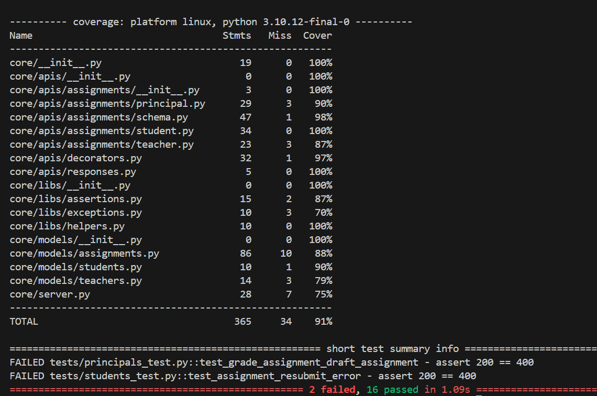

<h1 align="center" style="color:gray">
 Fyle Backend Intern Assignment
<br></h1>
I am Hardik Kalra and I have completed the assignment fulfilling all the requirements for this task.

## Results

- Studied and Developed all the existing and missing APIs and worked on them as asked.
- Added Test results for all of the APIs.
- Incorporated Bugs were idetified and have also been debugged.
- Dockerized the whole application and added the Dokcer file.
- Got the coverage report above 90%.


## Prerequisites

- Python 3.8 or higher
- Virtualenv
- Docker (optional, for containerized setup)

<h2 align="center" style="color:gray"><b>Project Setup</b></h2>

<h3 align="center" style="color:gray"><b>Local Setup</b></h3>

### Install requirements

```
virtualenv env --python=python3.8
source env/bin/activate
pip install -r requirements.txt
```
### Reset DB

```
export FLASK_APP=core/server.py
rm core/store.sqlite3
flask db upgrade -d core/migrations/
```
### Start Server

```
bash run.sh
```
### Run Tests

```
pytest -vvv -s tests/

# for test coverage report
# pytest --cov
# open htmlcov/index.html
```

<h3 align="center" style="color:gray"><b>Docker Setup</b></h3>

### Build the Docker Image

```
docker build -t fyle-backend-intern .
```
### Run the Docker Container

```
docker run -p 5000:5000 fyle-backend-intern
```
<h3 align="center" style="color:gray">
⇩  Test coverage  ⇩
</h3>


